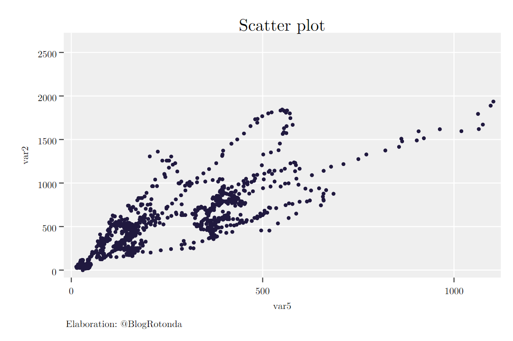
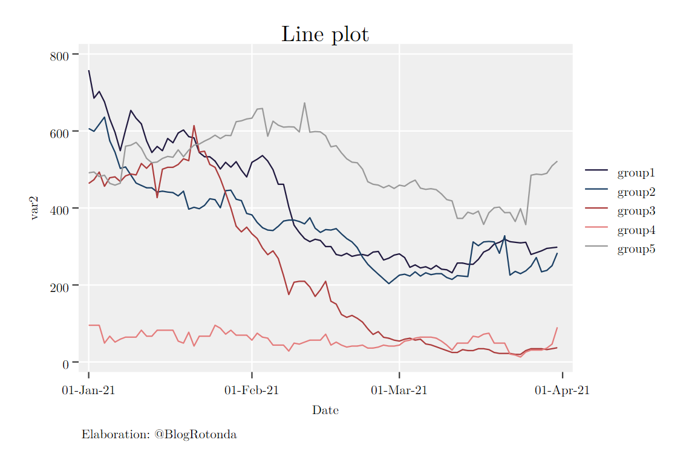
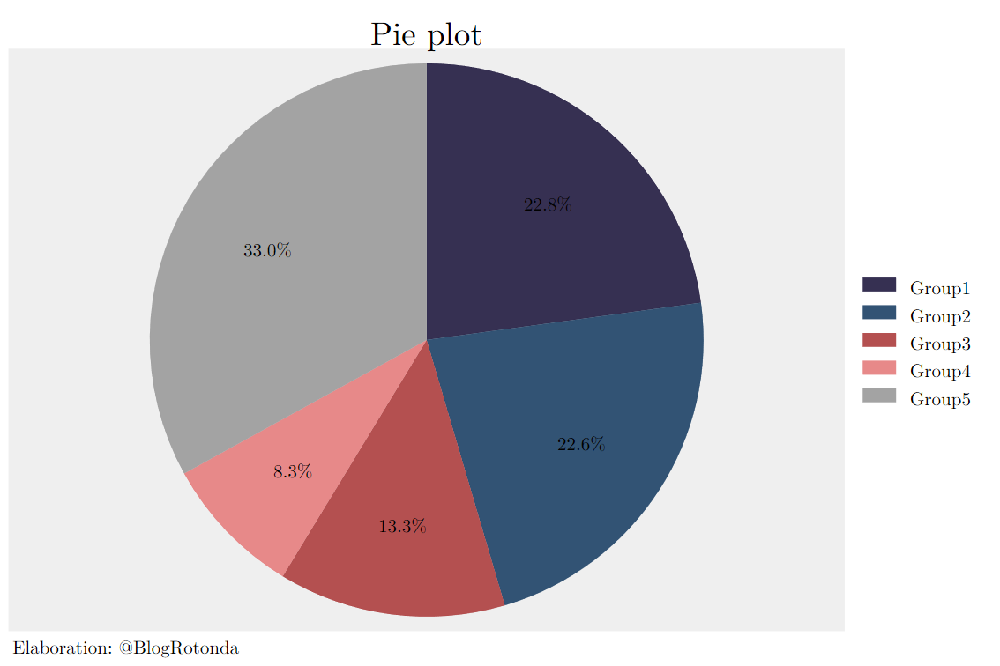
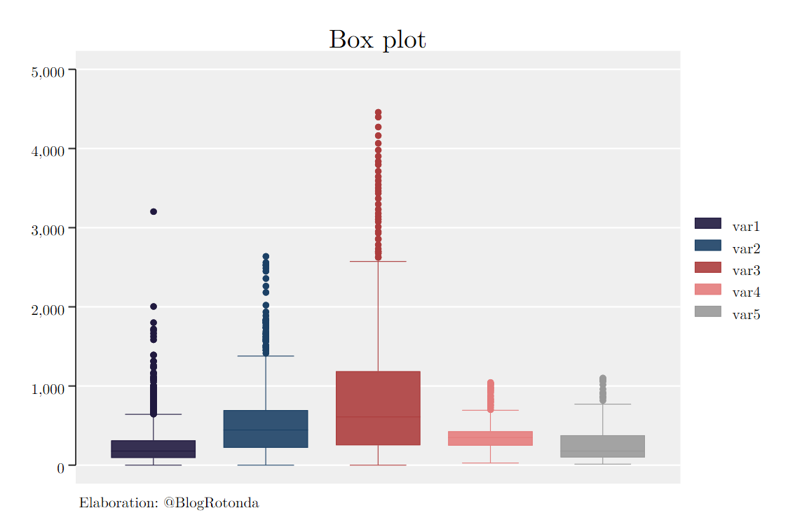
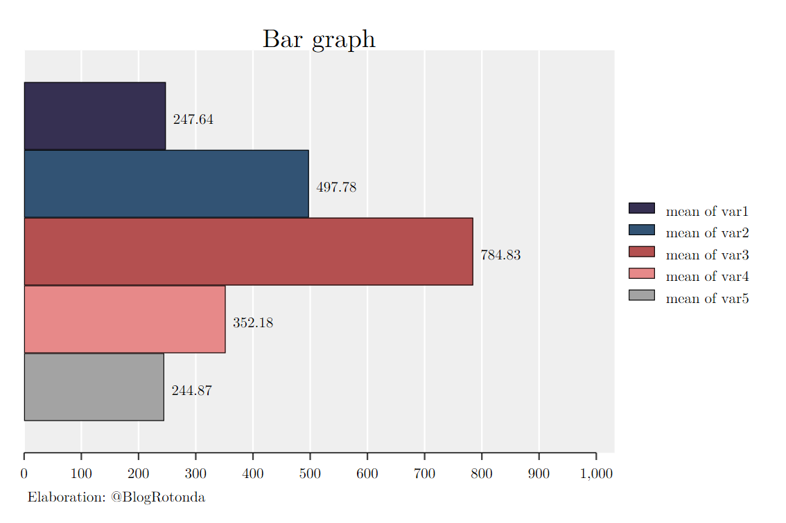
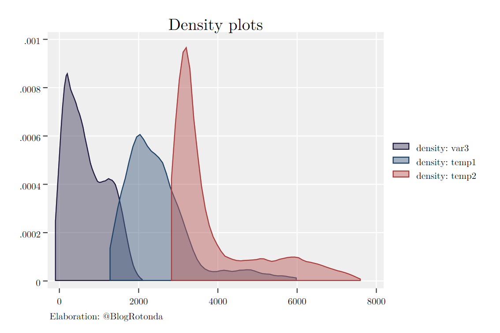
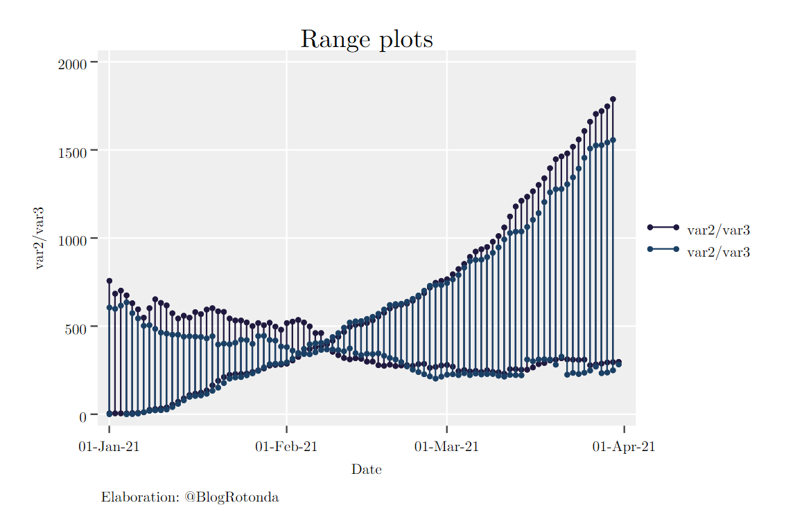
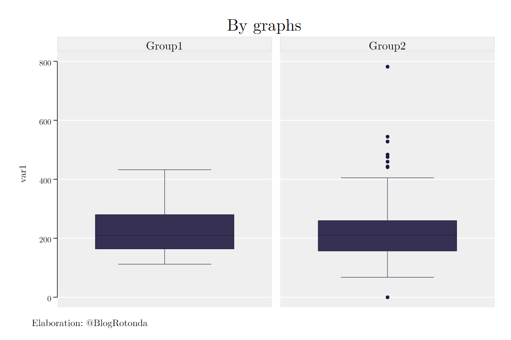

# blogrotonda Stata Graph Scheme
Personalized Stata scheme for visualizations of Rotonda's articles and documents.

```
net install github, from("https://haghish.github.io/github/")
github install La-Rotonda/blogrotonda

set scheme blogrotonda, perm
```
## Overview
 
 
 
 

